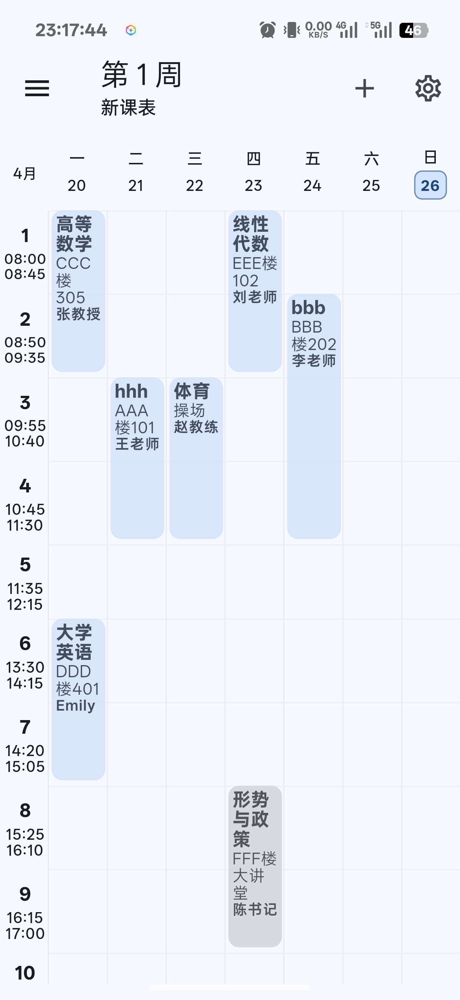
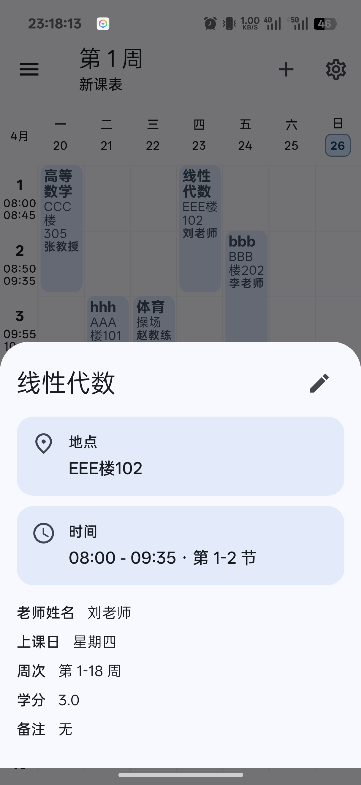
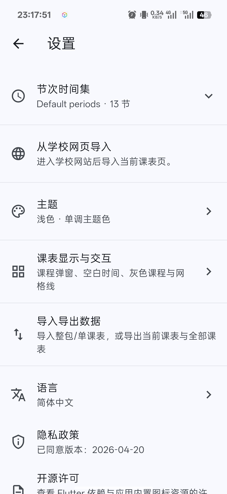
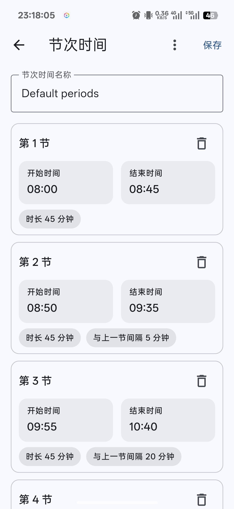
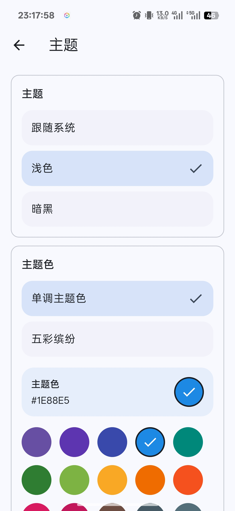
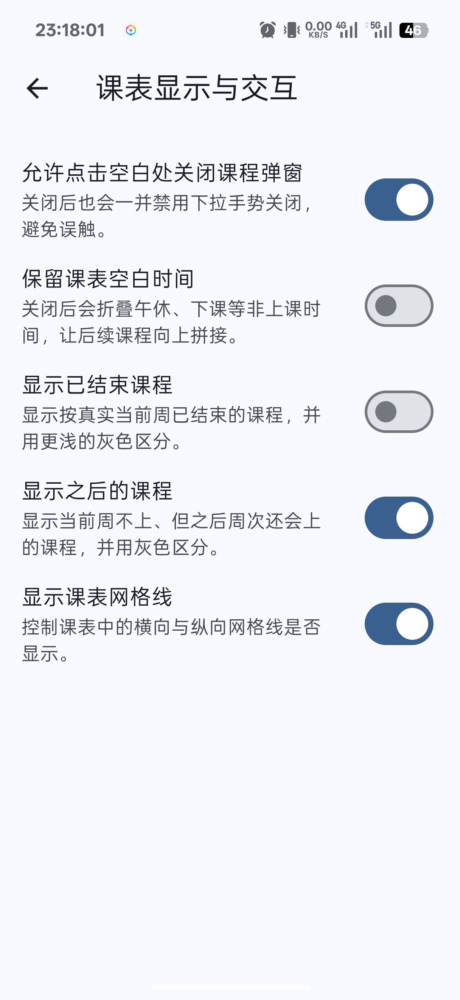
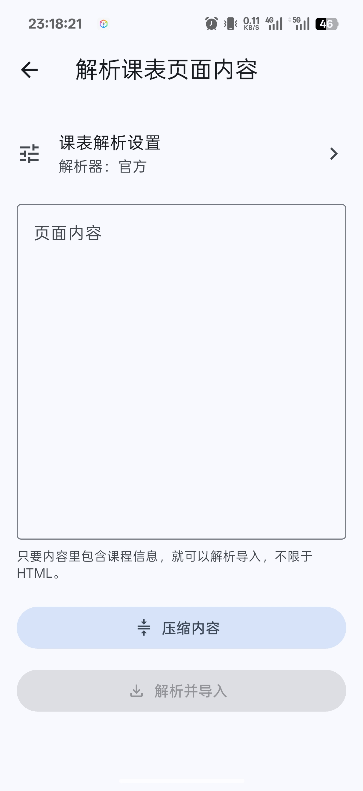

# Classmate

[](https://flutter.dev)
[](https://dart.dev)
[](https://m3.material.io)
[](LICENSE)

[中文 README](README.md)

Classmate is a Flutter timetable app that supports multi-timetable management, course editing, reusable period-time sets, theme and display settings, privacy policy consent, update checks, and timetable import from school webpages or pasted HTML content.

## Features

- Multi-timetable management: create, switch, edit, and delete timetables, and browse the semester week by week
- Course editing: edit course name, location, teacher, weeks, time, linked periods, remarks, and custom fields
- Period-time sets: reuse, edit, import, and export them across multiple timetables
- Course reminders and display: highlight the current or next course, preserve timetable gaps, show past-ended or future courses, and toggle timetable grid lines
- Theme settings: light / dark / follow system, with both single-color themes and colorful UI modes
- School webpage / HTML import: open the school site in-app and import the current page, or paste HTML manually
- Import preview and merge behavior: review parsed results before import, choose the period-time set, and decide whether to import as a new timetable or replace the current one
- Data import/export: import, export, and share timetable JSON files or plain-text timetable content
- School site management: add, edit, delete, and import or export school-site JSON entries

Everyone is welcome to submit PRs to expand `assets/school_sites.json` with more school site entries.

## Screenshots

<table>
  <tr>
    <td align="center"></td>
    <td align="center"></td>
    <td align="center"></td>
    <td align="center"></td>
  </tr>
  <tr>
    <td align="center">Home</td>
    <td align="center">Course details</td>
    <td align="center">Settings</td>
    <td align="center">Edit period time set</td>
  </tr>
  <tr>
    <td align="center"></td>
    <td align="center"></td>
    <td align="center"></td>
    <td></td>
  </tr>
  <tr>
    <td align="center">Theme settings</td>
    <td align="center">Timetable display & interaction settings</td>
    <td align="center">Timetable parsing page</td>
    <td></td>
  </tr>
</table>

## Project structure

```text
lib/
├─ config/       # App configuration and endpoint settings
├─ data/         # Platform-specific storage implementations
├─ l10n/         # Localization resources, language metadata, and generated code
├─ models/       # Timetable, course, school-site, and import response models
├─ providers/    # App state management
├─ screens/      # Screens such as home, settings, import, and school-site management
├─ services/     # Import/export, parsing, sharing, and update services
└─ widgets/      # Timetable grid, course editor, course details, and import result widgets

assets/
├─ default_period_times.json
└─ school_sites.json

web/
└─ api.php
```

## Privacy policy

Timetables, timetable settings, period-time sets, and school-site configuration are stored locally on your device or in the browser, and are not automatically uploaded to the developer's server.
Only when you actively use features such as import, export, sharing, external links, update checks, or webpage parsing will the app read related content or hand the corresponding operation off to the system or your configured parsing endpoint.

A privacy policy consent dialog is shown on first launch. The full privacy policy can also be viewed in the app under `Settings → Privacy Policy`.

## School import backend

The project includes a self-hostable PHP relay endpoint: [web/api.php](web/api.php). By default, the app reads the school webpage import endpoint and update feed URL from [lib/config/app_config.dart](lib/config/app_config.dart), and both can be overridden with `--dart-define`.

- `SCHOOL_IMPORT_API_BASE_URL`: school webpage / HTML import endpoint
- `CLASSMATE_UPDATE_VERSION_URL`: custom update feed URL

### Backend configuration

You need to edit the configuration block at the top of `web/api.php`:

- `$relayUrl`: upstream AI API endpoint
- `$relayToken`: your API key
- `$model`: model name to use
- `$timeoutSeconds`: request timeout, currently 120 seconds by default
- `$sourceByteLimit`: max submitted content size, currently 300KB by default
- `$maxParsesPerIpPerDay`: max parsing requests per IP per day, currently 5 by default

### Backend behavior

- Forwards parsing requests through your own PHP service instead of exposing the upstream key in the client
- Returns a unified JSON response so the client can show parsed results and error messages directly
- Enforces submitted-content size limits and per-IP daily parsing limits
- Supports both school webpage import and pasted HTML import
- Submits page content, optional page title, page URL, and the current app language to the parsing endpoint

## Open-source license and third-party notices

- The source code is licensed under the [GNU Affero General Public License v3.0](LICENSE)
- Bundled launcher icon and related platform icon assets include third-party licensed material; see [NOTICE](NOTICE)
- Flutter package and third-party library licenses can be viewed in the app under `Settings → Open-source licenses`
