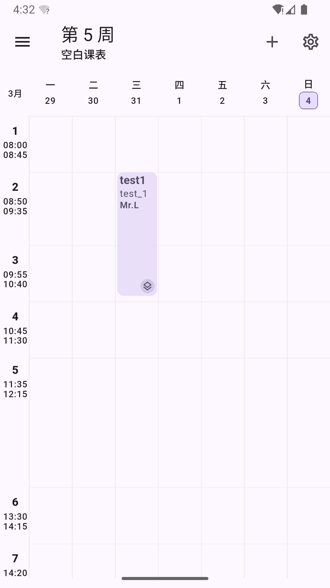
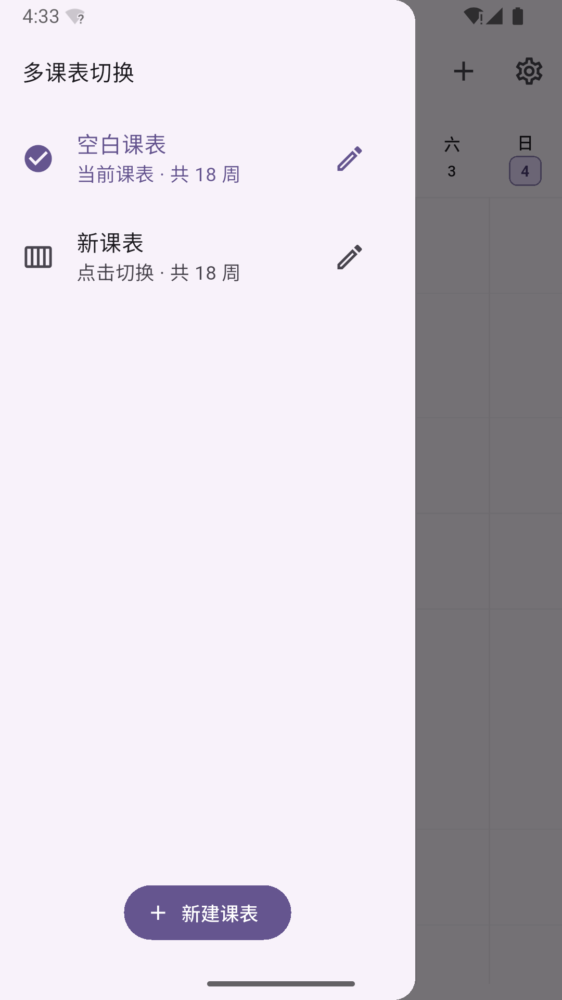
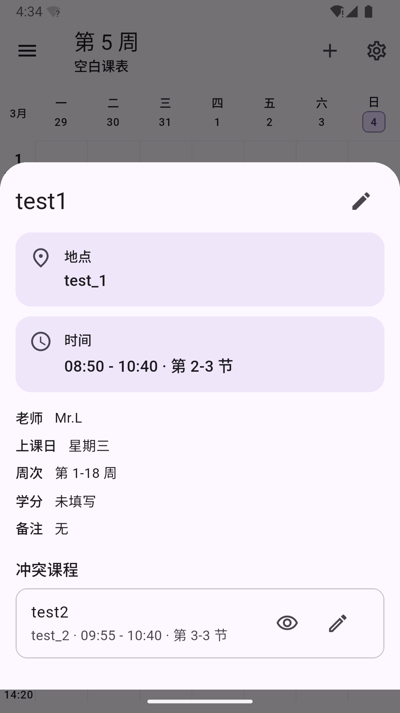
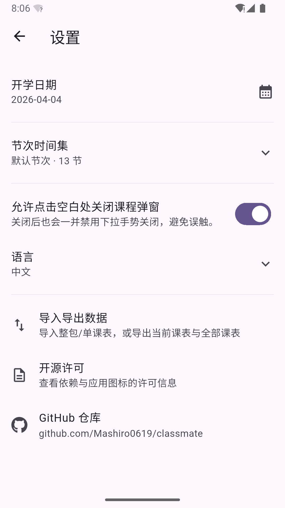

# Classmate

[](https://flutter.dev)
[](https://dart.dev)
[](https://m3.material.io)
[](LICENSE)

[中文 README](README.md)

Classmate is a Flutter timetable app for multi-timetable management, shared period-time sets, course editing, conflict display, and timetable/template import and export.

Supported targets: Android, iOS, Windows, macOS, Linux, and Web.

## Features

- Multi-timetable management: create, switch, rename, edit, and delete timetables
- Weekly timetable view with quick week jump, horizontal swipe navigation, and keyboard arrow key navigation
- Course management with location, teacher, credits, remarks, and custom fields
- Conflict handling with support for viewing conflicting courses and choosing which one is shown externally
- Shared period-time sets with create, select, edit, delete, and reuse support across timetables
- Template and data workflows for importing, exporting, sharing, and saving timetable JSON files and period templates
- Settings entry points for semester start date, period-time sets, open-source licenses, and the GitHub repository

## Screenshots

<table>
  <tr>
    <td align="center"></td>
    <td align="center"></td>
    <td align="center"></td>
    <td align="center"></td>
  </tr>
  <tr>
    <td align="center">Home</td>
    <td align="center">Drawer</td>
    <td align="center">Course details</td>
    <td align="center">Settings</td>
  </tr>
</table>

## Default data

On first launch, the app automatically creates:

- A default blank timetable named `空白课表`
- A built-in default period-time set loaded from [assets/default_period_times.json](assets/default_period_times.json)

If local data already exists, the app loads the saved data first.

## Project structure

```text
lib/
├─ data/         # Local storage and platform adapters
├─ models/       # Timetable, course, and period-time models
├─ providers/    # State management and import/export logic
├─ screens/      # Screens such as home, settings, and period-time editor
├─ services/     # Export and sharing services
└─ widgets/      # Timetable grid, course editor, and detail sheets
```

## Open-source license

This project is licensed under the [GNU Affero General Public License v3.0](LICENSE).

Bundled launcher icon assets include third-party licensed material. See [NOTICE](NOTICE) for details.
