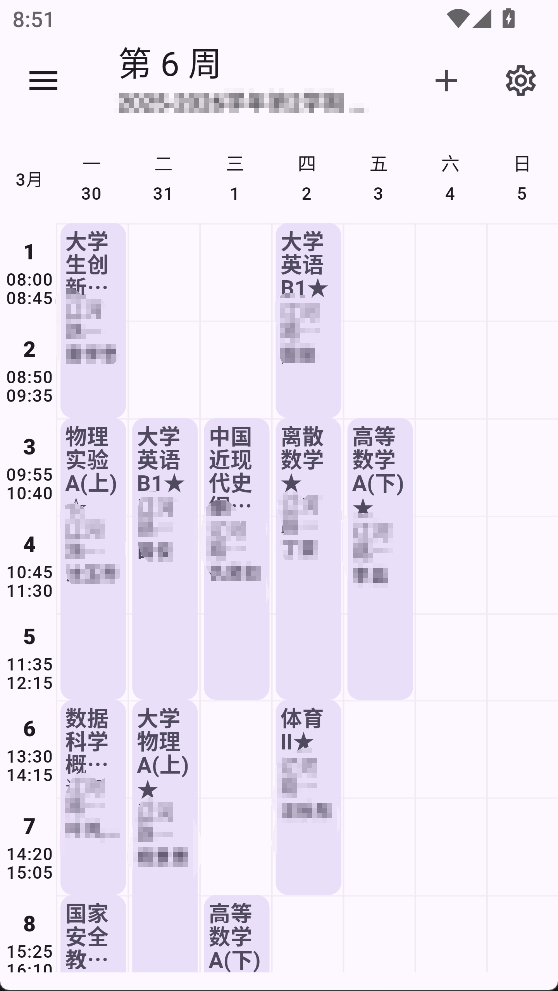
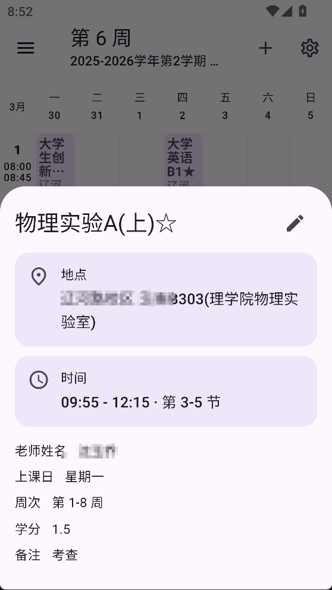
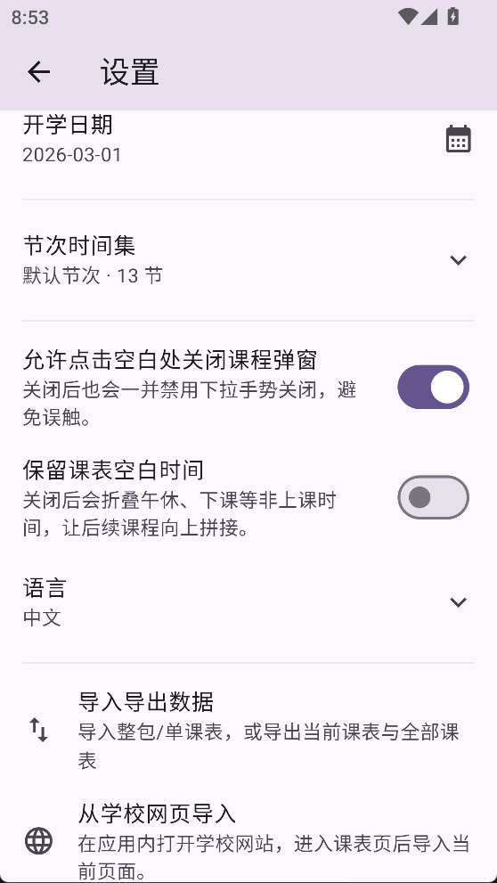
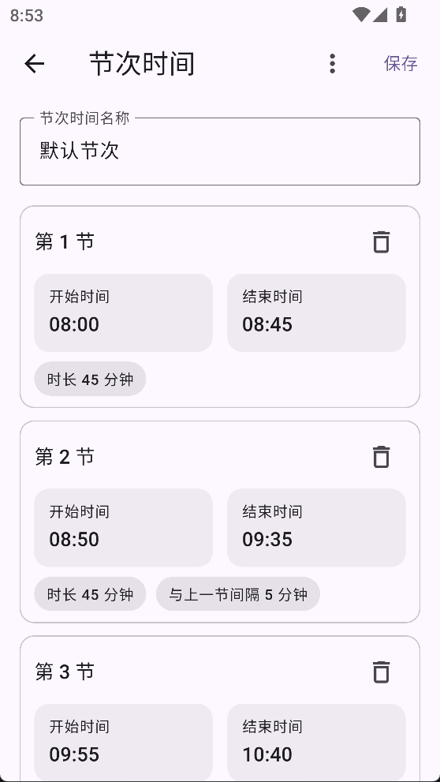

# Classmate

[](https://flutter.dev)
[](https://dart.dev)
[](https://m3.material.io)
[](LICENSE)

[中文 README](README.md)

Classmate is a local-first Flutter timetable app focused on timetable management, reusable period-time sets, course editing, and timetable import from school webpages or pasted HTML source.

## Features

- Multi-timetable and course management
- Reusable period-time sets
- School site management
- School webpage / HTML import
- Import preview with editable timetable info
- Timetable, period-template, and school-site JSON import/export

Welcome to submit PRs to expand `assets/school_sites.json` with more school site entries.

## Screenshots

<table>
  <tr>
    <td align="center"></td>
    <td align="center"></td>
    <td align="center"></td>
    <td align="center"></td>
  </tr>
  <tr>
    <td align="center">Home</td>
    <td align="center">Course details</td>
    <td align="center">Settings</td>
    <td align="center">Edit period time set</td>
  </tr>
</table>

## School import backend

The project includes a single-file PHP relay endpoint: [web/api.php](web/api.php)

### Backend configuration

Only the configuration block at the top of `web/api.php` needs to be edited:

- `$relayUrl`: upstream AI API endpoint
- `$relayToken`: your API key
- `$model`: model name to use
- `$timeoutSeconds`: request timeout, currently 120 seconds by default
- `$sourceByteLimit`: max submitted content size, currently 300KB by default
- `$maxParsesPerIpPerDay`: max parsing requests per IP per day, currently 5 by default

### Current backend behavior

- Uses your configured API key through your own PHP relay service
- Returns structured JSON so the client can show the real error directly
- Enforces submitted-content size limits and per-IP daily parsing limits
- Supports webpage-source import and does not require strictly valid HTML input

## Project structure

```text
lib/
├─ config/       # App configuration and default API URL
├─ models/       # Timetable, course, school-site, and import response models
├─ providers/    # State management and import/export logic
├─ screens/      # Screens such as home, settings, and school-site management
├─ services/     # Export, sharing, import API, and local storage services
└─ widgets/      # Timetable grid, course editor, and import preview widgets

web/
└─ api.php
```

## Privacy policy

The app currently follows a local-first design. Timetables, period times, and school-site configuration are stored locally by default.
Only actions you explicitly trigger — such as import, export, sharing, or submitting current webpage / pasted HTML content for parsing — will process the corresponding data.

The full privacy policy can be viewed in the app under `Settings → Privacy Policy`.

## Open-source license and third-party notices

- The source code is licensed under the [GNU Affero General Public License v3.0](LICENSE)
- Bundled launcher icon and related platform icon assets include third-party licensed material; see [NOTICE](NOTICE)
- Flutter package and third-party library licenses can be viewed in the app under `Settings → Open-source licenses`
